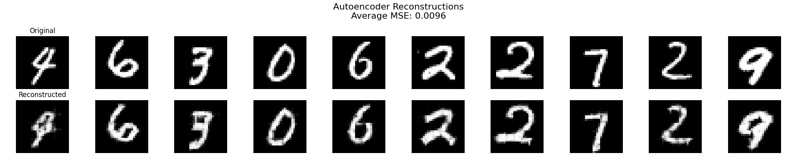
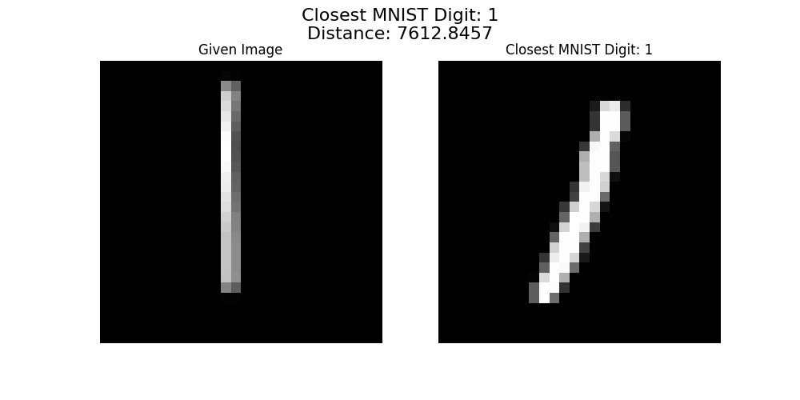

Simple out-of-distribution detector for MNIST Digits. 

Trains an autoencoder to learn a laten space for the MNIST dataset. Will return the closest example from a small set of examples, otherwise will return OOD.

Usage:

>> python train.py num_epochs # train model and save locally
>> python infer.py /path/to/converted/image # run model inference and return representative or OOD

Examples:

Training of Autoencoder: 

Example of lookup of nearest image to drawn one:

